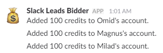
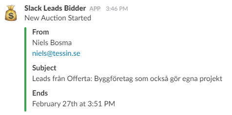
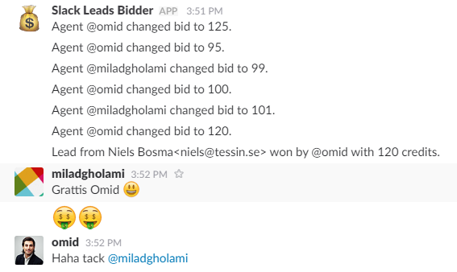

# Gamification of assigning leads using Slack

**[Read full story]()**

## Requirements

* .Net hosting with HTTPS
* Slack
* Mandrill
* MSSQL

## Installation 

* Setup a ConnectionString to a MSSQL database in Web.config. 
* Run Enable-Migrations and Update-Database in Package Manager Console to initiate the database. 
* In Slack create a channel and under *Custom Integrations* add a *Incoming WebHooks* for this channel. Enter the generated webhook url in Web.config. 
* Add these *Slack Commands* and enter tokens in Web.config:
   * /bid POST to https://yourdomain/api/slack/bid
   * /autobid POST to https://yourdomain/api/slack/autobid
   * /bids POST to https://yourdomain/api/slack/bids
   * /balance POST to https://yourdomain/api/slack/balance
* Get a Mandrill API key and setup in Web.config. 
* In Mandrill setup an *Inbound Domain* and point this to https://yourdomain/api/mandrill/inbound.
* In the database there's now a *Agents* table. For each agent add a row. 
   * SlackId should be the user name in Slack
   
  ## Usage in Slack
  
   ### /balance  
   Show balance for each agent. (private)
   
   ### /bids 
   Show all bids for current auction. (private)
   
   ### /bid X
   Set your bid to X for current auction. 
   
   ### /bid
   Get your current bid. (private)
   
   ### /autobid X
   Set your autobid to X for future auctions
   
   ### /autobid
   Get your current autobid. (private)
   
   
  
  

